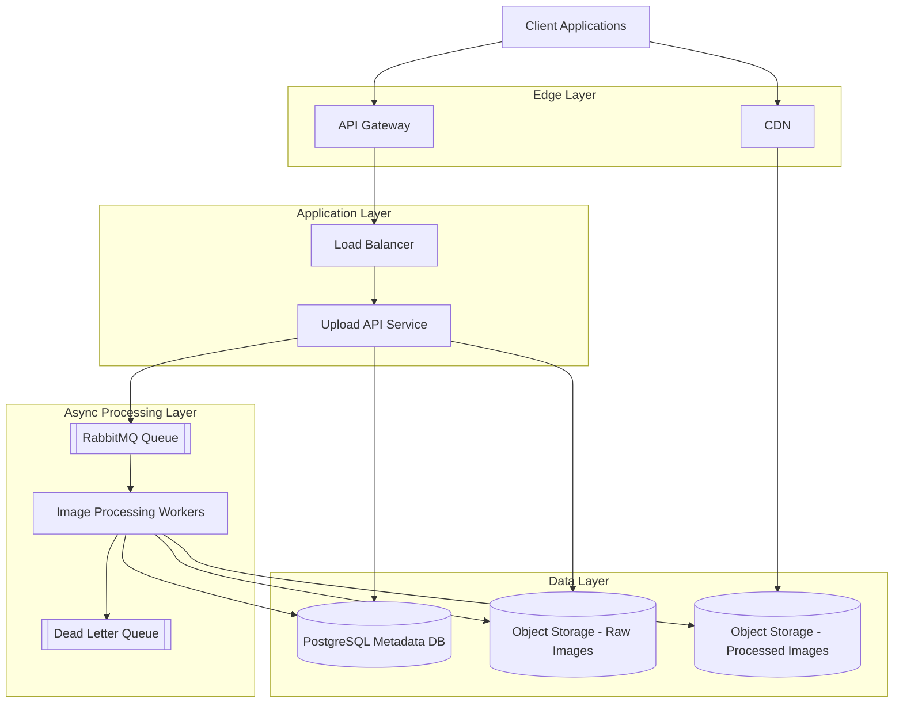

# System Design Diagram

## Flow Explanation

### Upload Path
- Client sends upload request through API Gateway
- Load Balancer forwards the request to Upload API Service
- Upload API stores the original image in raw object storage
- Upload API stores metadata in PostgreSQL
- Upload API publishes an image processing job to RabbitMQ

### Processing Path
- Worker consumes the processing job from RabbitMQ
- Worker fetches the raw image
- Worker performs resize, crop, watermark, compression, or format conversion
- Worker stores processed image variants in processed object storage
- Worker updates image status and metadata in PostgreSQL
- If processing repeatedly fails, the job is pushed to Dead Letter Queue

### Delivery Path
- Client requests processed images through CDN
- CDN serves cached images where available
- If cache is missed, CDN fetches from processed object storage